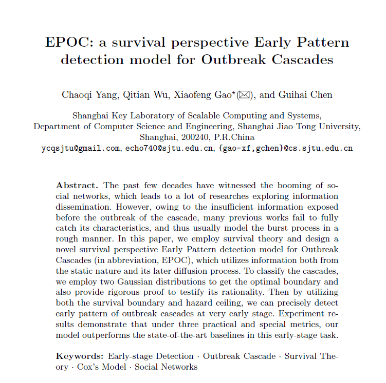

# EPOC-cascade-diffusion
#### Author: <a href="http://chaoqiyang.com">Chaoqi Yang</a>, Q. Wu, X. Gao, G. Chen.
Conference: 29th International Conference on Database and Expert System Applications - DEXA2018[accepted]
---
Here we employ survival theory to capture the diffusion property of cascades, regarding the cascades as lively creatures in nature. The work has been accepted in <a href="http://www.dexa.org/accepted_papers/678">29th International Conference on Database and Expert System Applications - DEXA2018</a>

---
<strong>Edited on Aug. 20th, 2018</strong> 
- Contact <a href="http://chaoqiyang.com">Chaoqi Yang</a> at ycqsjtu@gmail.com, Shanghai Jiao Tong University for more information!
